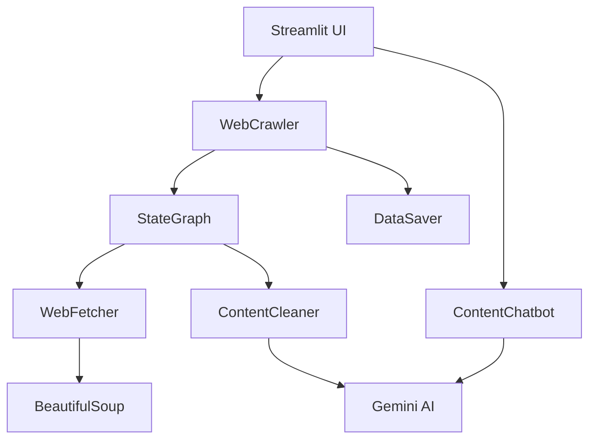

# AI Web Crawler

> **Yapay zeka destekli akıllı web tarama ve analiz platformu**

[](https://python.org)
[](https://streamlit.io)
[](https://langchain.com)
[](https://ai.google.dev)

##  Özellikler

###  **Akıllı Web Tarama**
- **Çoklu Derinlik Tarama**: Ana sayfa ve alt sayfaları otomatik keşfetme
- **Özelleştirilebilir Parametreler**: Link sayısı ve tarama derinliği kontrolü
- **Hata Toleranslı**: Başarısız sayfaları atlayıp taramaya devam etme

###  **AI-Powered İçerik İşleme**
- **Google Gemini 2.0 Entegrasyonu**: Son teknoloji AI ile içerik analizi
- **Akıllı İçerik Temizleme**: Gereksiz HTML elementlerini otomatik filtreleme
- **Yapılandırılmış Veri Çıkarma**: Ana makale içeriğini hassas şekilde ayıklama

###  **Interaktif AI Asistan**
- **Bağlamsal Sohbet**: Taranan içerikler hakkında akıllı sorular sorma
- **Gerçek Zamanlı Analiz**: Anlık içerik analizi ve özetleme
- **Türkçe Destek**: Tam Türkçe dil desteği

### **Veri Yönetimi**
- **Çoklu Format Desteği**: JSON ve PDF export seçenekleri
- **Detaylı İstatistikler**: Karakter, kelime sayısı ve başarı oranları
- **İndirilebilir Raporlar**: Taranan verileri kolayca kaydetme

###  **Modern UI/UX**
- **Gradient Tasarım**: Modern ve görsel olarak çekici arayüz
- **Responsive Layout**: Mobil ve masaüstü uyumlu
- **Real-time Feedback**: Anlık ilerleme göstergeleri

## 🏗️ Mimari



###  Proje Yapısı
```
 ai-webcrawler/
├── 📄 crawler.py          # Ana crawler sınıfı
├── 📄 stream_app.py       # Streamlit uygulaması
├── 📂 pipeline/
│   ├── 📄 state.py        # Veri durumu tanımları
│   ├── 📄 fetcher.py      # Web sayfası getirici
│   ├── 📄 cleaner.py      # AI destekli içerik temizleyici
│   ├── 📄 chatbot.py      # AI sohbet asistanı
│   └── 📄 saver.py        # Veri kaydetme modülü
├── 📄 requirements.txt    # Python bağımlılıkları
├── 📄 .env               # Çevre değişkenleri
└── 📄 README.md          # Bu dosya
```

## ⚡ Hızlı Başlangıç

### 1️⃣ Kurulum

```bash
# Repository'yi klonlayın
git clone https://github.com/kullaniciadi/ai-webcrawler.git
cd ai-webcrawler

# Virtual environment oluşturun
python -m venv venv
source venv/bin/activate  # Windows: venv\Scripts\activate

# Bağımlılıkları yükleyin
pip install -r requirements.txt
```

### 2️⃣ API Anahtarı Yapılandırması

`.env` dosyası oluşturun:

```bash
GEMINI_API_KEY=your_gemini_api_key_here
```

> 🔑 **API Anahtarı Alma**: [Google AI Studio](https://makersuite.google.com/app/apikey)'dan ücretsiz Gemini API anahtarı alabilirsiniz.

### 3️⃣ Uygulamayı Çalıştırın

```bash
streamlit run stream_app.py
```

🎉 **Tebrikler!** Uygulama `http://localhost:8501` adresinde çalışıyor.

## 🎮 Kullanım Rehberi

### **Web Sitesi Tarama**

1. **URL Girişi**: Sol panelden taramak istediğiniz web sitesi adresini girin
2. **Parametreleri Ayarlayın**:
   - **Derinlik**: `0` (sadece ana sayfa) - `5` (5 seviye alt sayfa)
   - **Link Sayısı**: Her seviyeden kaç link takip edileceği (1-10)
3. **Format Seçin**: JSON (yapılandırılmış) veya PDF (okunabilir)
4. **Tarama Başlatın**: "🚀 Tarama Başlat" butonuna tıklayın

### **AI Asistan Kullanımı**

Tarama tamamlandıktan sonra sağ panelden:

```
💡 Örnek Sorular:
• "Bu metinde hangi ana konular var?"
• "En önemli bilgiler nelerdir?"
• "Bu sayfa ne hakkında?"
• "Önemli istatistikler var mı?"
```

## 🔧 Teknik Detaylar

### **Kullanılan Teknolojiler**

| Teknoloji | Versiyon | Amaç |
|-----------|----------|------|
| **Python** | 3.8+ | Ana programlama dili |
| **Streamlit** | 1.28+ | Web UI framework |
| **LangGraph** | Latest | İş akışı yönetimi |
| **Google Gemini** | 2.0-flash | AI içerik analizi |
| **BeautifulSoup** | 4.12+ | HTML parsing |
| **Requests** | 2.31+ | HTTP istekleri |
| **FPDF** | 4.2+ | PDF oluşturma |

### **Özellik Detayları**

#### 🔄 **StateGraph Pipeline**
- **Modüler Yapı**: Her işlem ayrı node olarak tanımlanmış
- **Hata Yönetimi**: Pipeline herhangi bir aşamada hata durumunda güvenli şekilde devam eder
- **Durum Takibi**: Her aşamada veri durumu korunur ve takip edilir

#### 🧠 **AI İçerik İşleme**
- **Akıllı Temizleme**: Gemini AI navigasyon, reklam, footer gibi gereksiz içerikleri otomatik tespit eder
- **Dil Koruma**: Orijinal içeriğin dilini koruyarak temizleme yapar
- **Yapılandırma**: Dağınık içeriği düzenli başlık ve paragraf yapısına dönüştürür

## 🚀 Gelişmiş Kullanım

### **Özelleştirme Seçenekleri**

```python
# Crawler parametreleri
crawler = WebCrawler()
results = crawler.crawl(
    url="https://example.com",
    depth=0,           # Başlangıç derinliği
    max_depth=2,       # Maksimum tarama derinliği  
    max_links=5,       # Her seviyeden link sayısı
    format_choice="JSON"  # Çıktı formatı
)
```

### **Pipeline Konfigürasyonu**

```python
# State tanımları
state = {
    "url": "target_url",
    "raw_data": {},           # Ham HTML verisi
    "cleaned_data": "",       # Temizlenmiş metin
    "depth": 0,              # Mevcut derinlik
    "max_depth": 3,          # Maksimum derinlik
    "max_links": 10,         # Link limiti
    "format_choice": "PDF"   # Export formatı
}
```

## 🐛 Sorun Giderme

### **Yaygın Sorunlar ve Çözümler**

| Sorun | Çözüm |
|-------|-------|
|  **API Anahtarı Hatası** | `.env` dosyasında `GEMINI_API_KEY` kontrolü |
|  **URL Erişim Hatası** | URL formatı ve internet bağlantısı kontrolü |
|  **UI Görünüm Sorunu** | Tarayıcı cache temizliği |
|  **Yavaş Performans** | Link sayısı ve derinlik parametrelerini azaltın |

### **Debug Modu**

```bash
# Detaylı log çıktısı için
streamlit run stream_app.py --logger.level=debug
```
### **Geliştirme Ortamı**

```bash
# Development bağımlılıklarını yükleyin
pip install -r requirements-dev.txt

# Pre-commit hooks kurulumu
pre-commit install

# Testleri çalıştırın
pytest tests/
```
